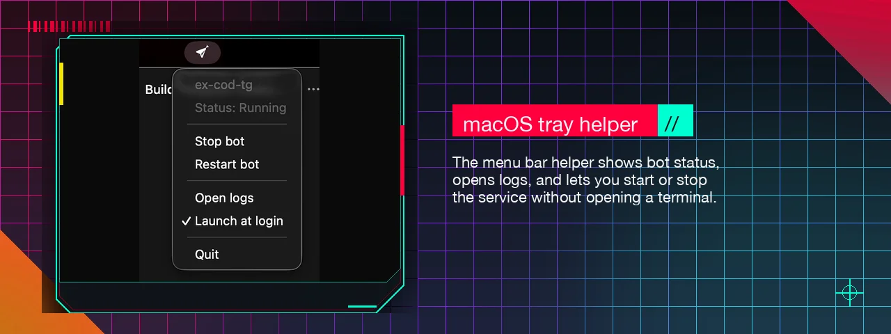
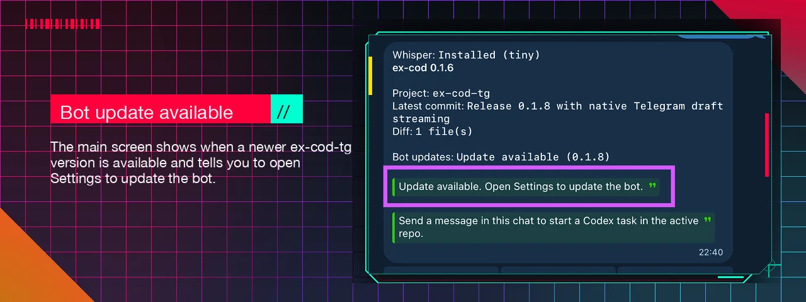
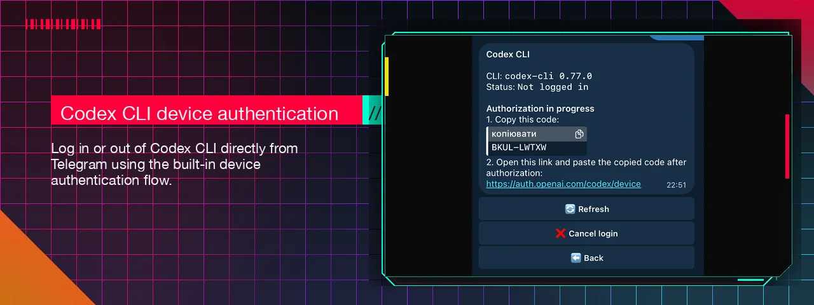
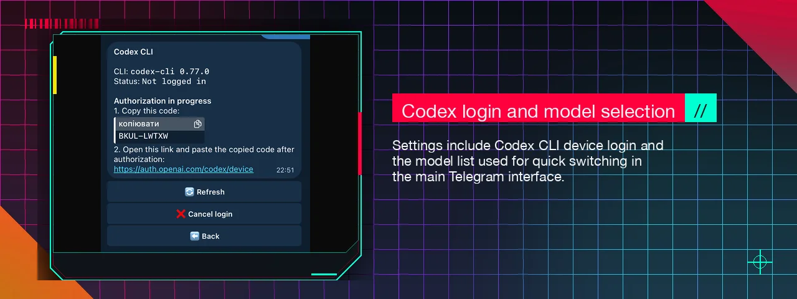
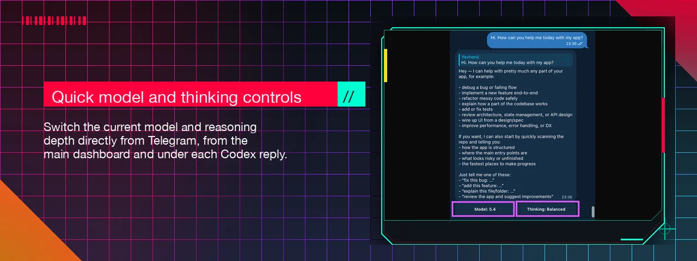
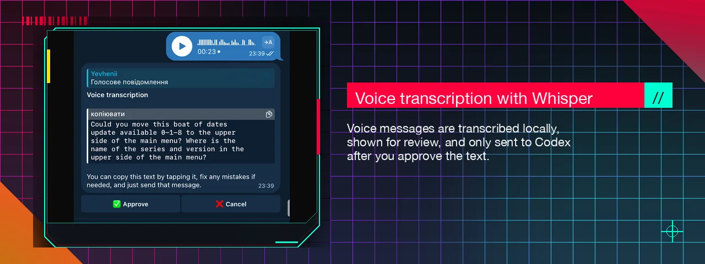

# ex-cod-tg

Telegram remote for Codex CLI running locally on your own machine.

Built for a simple workflow:

- install once on your machine
- open Telegram on your phone
- pick a repo and git branch
- send a normal message
- Codex works locally and streams the reply back into Telegram

## Core features

- control Codex CLI from Telegram
- run everything locally on your own machine
- macOS and Linux support
- automatic workspace root detection
- switch repositories and git branches from the main menu
- switch models and thinking depth in one tap
- choose your preferred models in Settings
- easy Codex CLI device login from Telegram
- optional Whisper voice transcription
- image input support for screenshots and UI references
- built-in admin access control
- self-update flow with GitHub update detection
- macOS tray helper with service controls and launch at login

## Quick Start

Install and set up the background service with one command:

```bash
curl -fsSL https://raw.githubusercontent.com/jekakiev/ex-cod-tg/main/install.sh | bash
```

After that:

1. Create a Telegram bot with [BotFather](https://t.me/BotFather).
2. Copy the bot token.
3. Paste it during onboarding.
4. Open the bot in Telegram and send `/start`.
5. The first user who sends `/start` becomes the first admin.

The only thing you need to enter in the terminal is your Telegram bot token. Workspaces root detection, active repo selection, model selection, and day-to-day settings happen inside the bot.


On macOS, the install also adds a menu bar helper so you can see bot status, open logs, and start or stop the bot from the system tray.



## How It Works

- the bot runs locally on your machine
- Telegram delivers messages through the internet, so your phone can be on any network
- all Codex, git, and shell commands execute on your machine
- the bot uses long polling, so no webhook, reverse proxy, or tunnel is required

## Bot Interface

### Main screen

- see the active repo, latest commit, diff summary, and bot update status
- switch repositories with `prev / next` or jump through `All repos`
- switch branches with `prev / next` or jump through `All branches`
- tap `Model` and `Thinking` to cycle the current Codex defaults instantly
- send a normal chat message at any time to start work in the active repo

When a newer `ex-cod-tg` version is available, the main screen shows an update notice and points you to Settings to install it.



### Settings

- manage admins directly from Telegram
- log in or out of Codex CLI with device auth
- choose which models appear in quick model switching
- install or remove local Whisper transcription
- update the bot from Telegram when GitHub shows a newer version
- change the workspaces root without editing config files, with manual path entry in chat for now





### Media input

- send screenshots and other image references with a caption to run immediately
- send images first and text next if you want to build the prompt in two steps
- send a voice message, review the Whisper transcription, and approve it before Codex runs

## Installation Details

`install.sh` is the one-command installer:

- creates an isolated virtual environment for `ex-cod-tg`
- installs `ex-cod-tg` from GitHub into that environment
- installs Codex CLI automatically via npm when `codex` is missing
- creates a local `ex-cod-tg` CLI shim in `~/.local/bin`
- runs `ex-cod-tg service install`
- on macOS, also installs the menu bar helper so the bot and helper launch together at login

## Chat and Commands

Plain chat is the default interface.

- `/start` — open the main dashboard
- `/help` — show help
- `/run <command>` — run a restricted shell command
- `/diff` — show git diff
- `/log` — show recent commits

Most Codex work does not need a slash command. Just send a normal message in chat.

That includes asking questions, fixing bugs, refactoring, writing code, and even asking Codex to create a commit.

Photos and image files also work:

- send an image with a caption to run Codex immediately
- send an image without a caption and the bot keeps it pending for the next text message
- up to `TELEGRAM_MAX_IMAGES_PER_REQUEST` images are kept per request, with temp files cleaned up after execution

Model and thinking level are switched directly from the Telegram buttons on the dashboard and under each Codex reply.



Voice messages also work when Whisper is installed: the bot transcribes them locally, shows the text for confirmation, and only runs Codex after approval. Processing speed depends on your machine, and in my testing English works best so far. The preview message is easy to edit: tap it to copy the text, paste it into the input field, fix any mistakes, and send it back as a normal message.



## Configuration

Runtime config is stored outside the repo:

```text
macOS: ~/Library/Application Support/ex-cod-tg/config.env
Linux: ~/.config/ex-cod-tg/config.env
```

The installer and onboarding create this for you. In normal use you only need to paste the Telegram bot token once in the terminal.

After that, the practical settings live in the bot UI:

- active repository and branch
- selected models
- current model and thinking depth
- Codex CLI login
- Whisper install or removal
- workspaces root

Power users can still edit `config.env` manually, but most users never need to touch it.

## Security Notes

- only approved Telegram admin IDs can use the bot
- the first admin is claimed by the first `/start` when no admins exist yet
- `/run` uses a strict allowlist
- config and logs live in your user config/state folders, not in the repo

## Service Commands

The installer already sets up the background service for you.

After updating the repo:

```bash
ex-cod-tg service restart
```

## Notes

- `All repos` shows top-level folders inside the detected workspaces root
- `All branches` shows local git branches for the active repo
