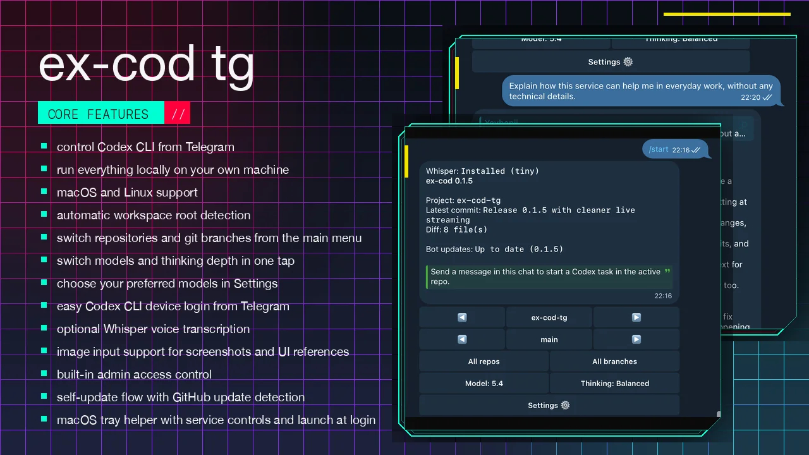
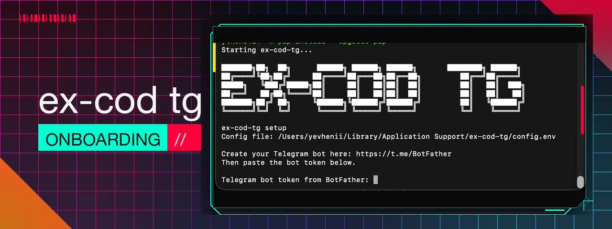

# ex-cod-tg

Remote Telegram interface for Codex CLI running on your computer.

Built for a simple workflow:

- run the bot on your machine
- open Telegram on your phone
- pick a repo and git branch
- send a plain message
- Codex works locally and streams the reply back into Telegram

## Features

- convenient auto-updating Telegram menu
- project switching with `prev / next` and `All repos`
- git branch switching with `prev / next` and `All branches`
- model and thinking-level switching for Codex tasks
- selected-model presets for quick switching
- plain chat messages sent directly to Codex with streaming output
- optional local Whisper transcription for Telegram voice messages
- in-app bot update button with release notes after restart
- built-in commands: `/ask`, `/fix`, `/diff`, `/log`, `/commit`, `/run`
- Codex CLI auth screen with login, logout, and refresh
- automatic first-admin bootstrap on the first `/start`
- admin management directly from Telegram
- async command queue so sessions do not overlap
- background service support for macOS and Linux

## Quick Start

Install and set up the background service with one command:

```bash
curl -fsSL https://raw.githubusercontent.com/jekakiev/ex-cod-tg/main/install.sh | bash
```

After that:

1. Create a Telegram bot with [BotFather](https://t.me/BotFather).
2. Copy the bot token.
3. Paste it during onboarding.
4. Open the bot in Telegram and send `/start`.
5. The first user who sends `/start` becomes the first admin.

The only thing you need to enter in the terminal is your Telegram bot token.



## How It Works

- the bot runs locally on your machine
- Telegram delivers messages through the internet, so your phone can be on any network
- all Codex, git, and shell commands execute on your machine
- the bot uses long polling, so no webhook, reverse proxy, or tunnel is required

## Installation Details

`install.sh` is the one-command installer:

- creates an isolated virtual environment for `ex-cod-tg`
- installs `ex-cod-tg` from GitHub into that environment
- creates a local `ex-cod-tg` CLI shim in `~/.local/bin`
- runs `ex-cod-tg service install`

## Telegram Commands

- `/start` — open the main dashboard
- `/help` — show help
- `/status` — refresh the dashboard
- `/model` — choose the Codex model and thinking level
- `/admins` — open admin management
- `/ask <text>` — send a prompt to Codex
- `/fix <task>` — ask Codex to fix something
- `/run <command>` — run a restricted shell command
- `/diff` — show git diff
- `/commit <message>` — run `git add -A` and create a commit
- `/log` — show recent commits

Plain text messages also work: just send a task in chat and Codex will start.

Voice messages also work when Whisper is installed: the bot transcribes them locally, shows the text for confirmation, and only runs Codex after approval.

## Configuration

Runtime config is stored outside the repo:

```text
macOS: ~/Library/Application Support/ex-cod-tg/config.env
Linux: ~/.config/ex-cod-tg/config.env
```

That matters for security:

- your real Telegram bot token is not stored in this repo by default
- `.env` is ignored
- local virtualenvs, logs, caches, and build artifacts are ignored

Example config:

```env
TELEGRAM_BOT_TOKEN=1234567890:telegram-token
ADMIN_IDS=
WORKSPACES_ROOT=/Users/your-user/Developer
ACTIVE_PROJECT_PATH=/Users/your-user/Developer/your-project
CODEX_BIN=codex
CODEX_MODEL=gpt-5.4
CODEX_SELECTED_MODELS=gpt-5.4,gpt-5.4-mini
CODEX_THINKING_LEVEL=high
COMMAND_TIMEOUT_SECONDS=900
SHELL_TIMEOUT_SECONDS=120
GIT_TIMEOUT_SECONDS=120
MAX_OUTPUT_CHARS=20000
```

## Security Notes

- only approved Telegram admin IDs can use the bot
- the first admin is claimed by the first `/start` when no admins exist yet
- `/run` uses a strict allowlist
- config and logs live in your user config/state folders, not in the repo

## Service Commands

The installer already sets up the background service for you.

Manual service management after installation:

After updating the repo:

```bash
ex-cod-tg service restart
```

To remove the service:

```bash
ex-cod-tg service uninstall
```

## Notes

- `All repos` shows top-level folders inside `WORKSPACES_ROOT`
- `All branches` shows local git branches for the active repo
- if Codex CLI is missing, the bot still starts, but Codex actions will fail until `codex` is installed
